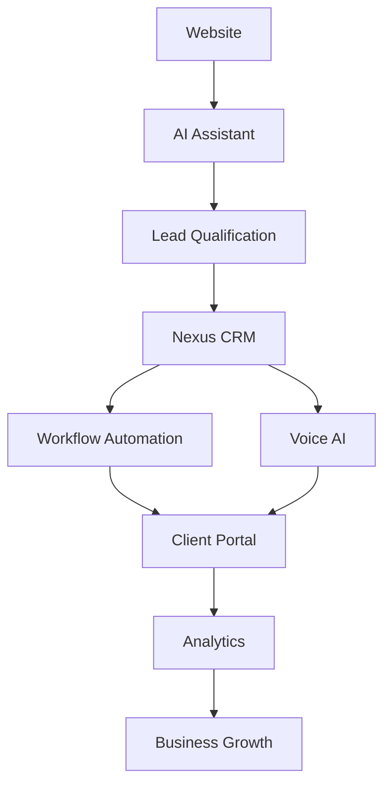

# Product Ecosystem

> Internal Document

Version: 1.0

Status: Active

Owner: Nexus AI

Last Updated: July 2026

---

# Purpose

This document defines how every Nexus AI product fits into a single connected ecosystem.

Rather than building standalone applications, Nexus AI develops products that work together to create a seamless business operating system.

Every product should increase the value of the entire platform.

---

# Ecosystem Vision

Nexus AI is building an Intelligent Business Platform.

Each product solves a different operational challenge while sharing a common philosophy, design language, and user experience.

The platform becomes more valuable as businesses adopt additional Nexus AI products.

---

# Current Products

## Nexus CRM

Purpose

Serve as the operational center of every business.

Responsibilities

- Customer management
- Sales pipeline
- Lead management
- Contact database
- Task management
- Workflow automation
- Reporting

---

## Nexus AI Assistant

Purpose

Act as the intelligent communication layer between businesses and customers.

Responsibilities

- Answer customer questions
- Qualify leads
- Schedule appointments
- Capture information
- Route conversations
- Support sales and customer service

---

# Future Products

## Nexus Voice

Purpose

Provide AI-powered voice interactions.

Responsibilities

- Incoming calls
- Outgoing follow-ups
- Appointment confirmations
- Customer support
- Voice-based lead qualification

---

## Nexus Automations

Purpose

Reduce repetitive work across business operations.

Responsibilities

- Workflow automation
- Internal notifications
- CRM automation
- Email sequences
- Task creation
- Business rules

---

## Nexus Client Portal

Purpose

Provide customers with a centralized workspace.

Responsibilities

- Project tracking
- Documents
- Communication
- Invoices
- Service requests
- Account management

---

## Nexus Analytics

Purpose

Transform operational data into business intelligence.

Responsibilities

- Dashboards
- KPIs
- Sales reports
- Automation reports
- Customer insights
- Performance analytics

---

# Product Relationships

Every product strengthens another product.

Example:

CRM stores customer data.

↓

AI Assistant uses CRM information.

↓

Voice AI handles phone conversations.

↓

Automations execute workflows.

↓

Analytics measure business performance.

No product should operate in isolation.

---

# Customer Journey

A typical customer journey should look like this:

Visitor

↓

Website

↓

AI Assistant

↓

Lead Qualification

↓

Book Demo

↓

CRM

↓

Automations

↓

Voice AI

↓

Analytics

↓

Long-Term Customer Success

---

# Ecosystem Principles

Every product must:

- Share a common design language.
- Follow the same engineering standards.
- Integrate naturally.
- Exchange information securely.
- Scale with business growth.

Users should feel like they are using one platform rather than multiple disconnected applications.

---

# Integration Philosophy

Products should communicate through secure APIs and shared business logic.

Whenever possible:

- Avoid duplicate data.
- Maintain a single source of truth.
- Synchronize information automatically.
- Reduce manual data entry.

---

# Growth Strategy

The platform should expand gradually.

Future products should strengthen the ecosystem rather than increase complexity.

Every new product must answer two questions:

- Does it solve a meaningful business problem?
- Does it improve the overall platform?

If the answer is no, it should not be built.

---

# Long-Term Vision

The future of Nexus AI is not defined by the number of products.

It is defined by how well those products work together.

Our objective is to build an intelligent business platform where technology feels connected, reliable, and effortless.

## Ecosystem Overview

