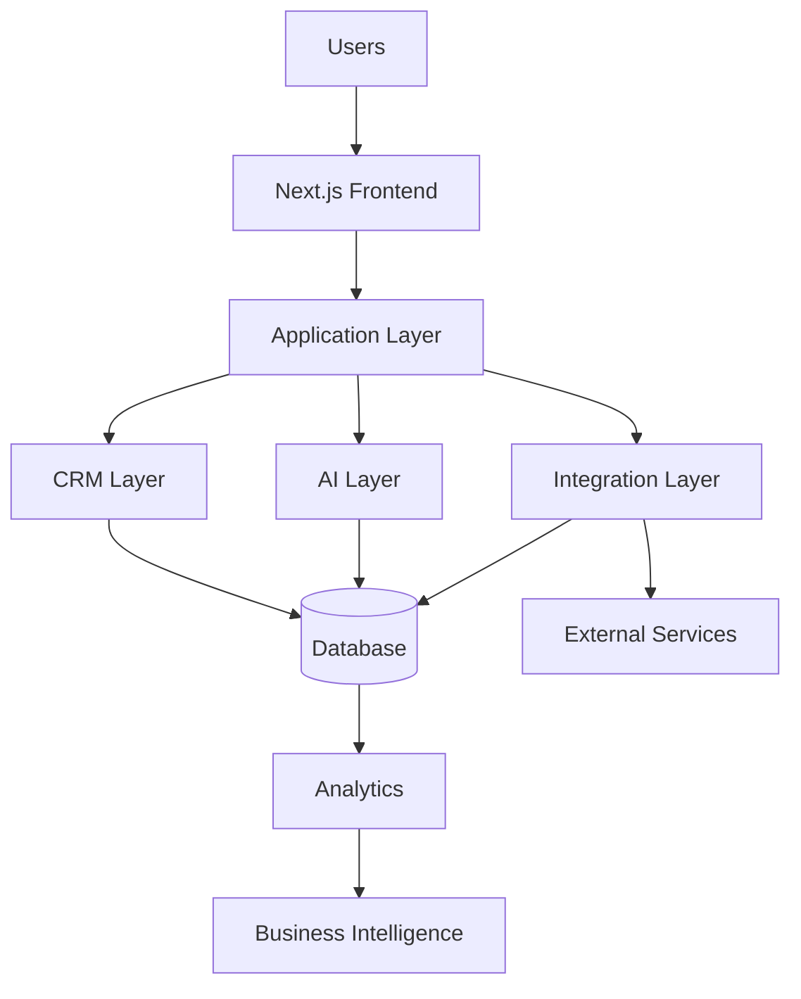

# System Architecture

> Internal Document

Version: 1.0

Status: Active

Owner: Nexus AI

Last Updated: July 2026

---

# Purpose

This document defines the technical architecture of the Nexus AI ecosystem.

Its purpose is to establish a scalable, secure, and maintainable foundation that supports current products and future platform expansion.

Every engineering decision should align with this architecture.

---

# Architecture Principles

The platform should be:

- Modular
- Scalable
- Secure
- API-first
- Cloud-native
- Performance-oriented
- Maintainable

Each layer should have a single responsibility.

---

# Platform Overview

The Nexus AI ecosystem consists of multiple connected layers.

Business Layer

↓

Presentation Layer

↓

Application Layer

↓

Integration Layer

↓

Data Layer

↓

Infrastructure Layer

---

# Presentation Layer

Responsible for delivering user experiences.

Current Technologies

- Next.js
- React
- TypeScript
- Tailwind CSS
- Framer Motion

Responsibilities

- User Interface
- Responsive Layouts
- Client-side Routing
- Theme Management
- Accessibility

---

# Application Layer

Responsible for business logic.

Responsibilities

- Authentication
- User Management
- CRM Logic
- Workflow Engine
- AI Requests
- Form Processing
- Notifications

Business logic should remain independent from UI components.

---

# AI Layer

Responsible for intelligent interactions.

Capabilities

- AI Chat Assistant
- Lead Qualification
- Business Recommendations
- Content Generation
- Voice Intelligence
- Automation Decisions

AI should assist users without replacing human decision-making where unnecessary.

---

# CRM Layer

Acts as the operational center of the platform.

Responsibilities

- Customer Records
- Lead Management
- Pipelines
- Tasks
- Notes
- Communication History
- Automation Triggers

The CRM serves as the primary business database.

---

# Integration Layer

Responsible for external services.

Examples

- Email Providers
- Calendar Systems
- Payment Platforms
- Voice Providers
- AI APIs
- CRM APIs
- Analytics Platforms

Every integration should use secure APIs.

---

# Data Layer

Responsible for data storage.

Primary Data

- Users
- Customers
- Leads
- Conversations
- Tasks
- Workflows
- Analytics

Data should follow a single source of truth.

Duplicate storage should be minimized.

---

# Security Layer

Security should be integrated throughout the platform.

Requirements

- Authentication
- Authorization
- Role-Based Access Control
- Secure API Communication
- Environment Variables
- Encryption
- Input Validation
- Audit Logs

Security is a core feature.

Not an optional enhancement.

---

# Infrastructure Layer

Responsible for deployment and operations.

Components

- Cloud Hosting
- CDN
- Database
- File Storage
- Monitoring
- Logging
- Backups

Infrastructure should support horizontal scaling.

---

# Monitoring

Every production environment should monitor:

- Application health
- API availability
- Performance
- Errors
- Database health
- Security events

Monitoring should enable proactive issue detection.

---

# Performance Goals

Target metrics

- Fast page loads
- Optimized assets
- Efficient API requests
- High Lighthouse scores
- Responsive interactions
- Minimal downtime

Performance should remain a product feature.

---

# Scalability Strategy

The platform should scale without major architectural changes.

Growth areas include:

- More customers
- More products
- More integrations
- More AI capabilities
- Global deployments

Architecture decisions should anticipate future expansion.

---

# Long-Term Vision

The Nexus AI architecture is designed to support an expanding ecosystem of intelligent business products.

As new technologies emerge, implementation details may evolve, but the architectural principles defined in this document should remain consistent.

The objective is not simply to build software.

The objective is to build a reliable technology platform that businesses can depend on for years to come.

## System Architecture Overview

